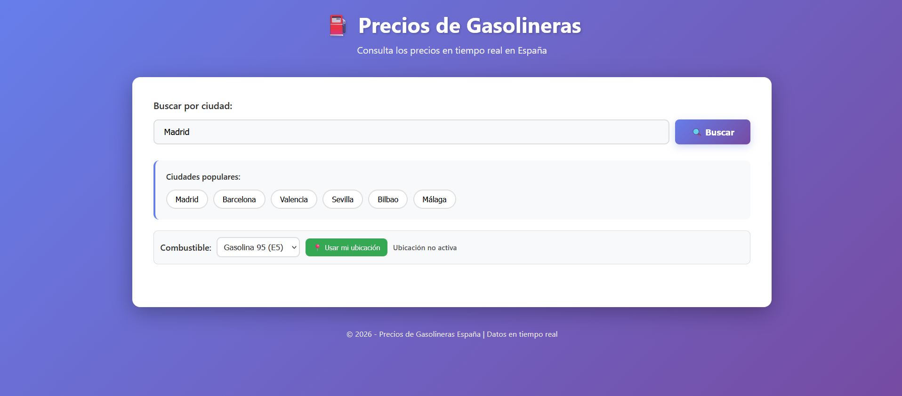
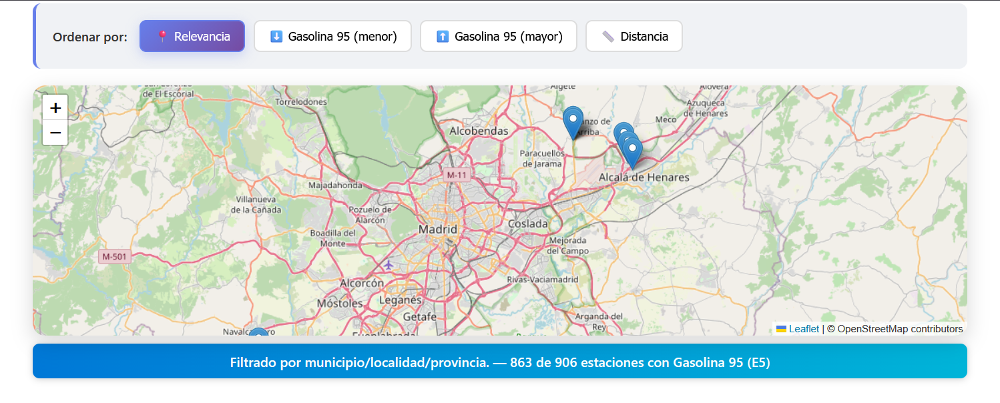

# ⛽ Precios de Gasolineras España

[](https://developer.mozilla.org/en-US/docs/Web/JavaScript)
[](https://developer.mozilla.org/en-US/docs/Web/HTML)
[](https://developer.mozilla.org/en-US/docs/Web/CSS)

Una aplicación web moderna y responsive para consultar los precios de combustible en tiempo real en España. Utiliza datos oficiales del Ministerio de Industria y muestra información detallada de gasolineras con mapas interactivos.

## ✨ Características

- 🔍 **Búsqueda por ciudad**: Encuentra gasolineras en cualquier ciudad española
- 📍 **Geolocalización**: Usa tu ubicación actual para encontrar gasolineras cercanas
- 🗺️ **Mapa interactivo**: Visualiza todas las gasolineras en un mapa con Leaflet
- ⛽ **Múltiples combustibles**: Gasolina 95, Gasolina 98 y Gasóleo A
- 📊 **Ordenación flexible**: Por precio, distancia o relevancia
- ⭐ **Favoritos**: Guarda tus gasolineras preferidas
- 📱 **Responsive**: Funciona perfectamente en móvil y escritorio
- ⚡ **Rápido**: Caché inteligente para búsquedas frecuentes
- 🔄 **Datos en tiempo real**: Información actualizada del Ministerio de Industria

## 🚀 Demo

[]

<p align="center">
  
</p>
<p align="center">
  
</p>

## 📋 Requisitos

- Navegador web moderno con JavaScript habilitado
- Conexión a internet para datos en tiempo real
- Geolocalización opcional (para ubicación automática)

## 🛠️ Instalación

### Opción 1: Ejecutar localmente (Recomendado)

```bash
# Clona el repositorio
git clone https://github.com/tu-usuario/precios-gasolineras.git
cd precios-gasolineras/app

# Instala http-server globalmente (si no lo tienes)
npm install -g http-server

# Ejecuta el servidor
http-server -p 8080 -c-1 --cors

# Abre en tu navegador: http://localhost:8080
```

### Opción 2: Abrir directamente en navegador

```bash
# Simplemente abre index.html en tu navegador
# Nota: Algunos navegadores bloquean CORS para archivos locales
```

## 📖 Uso

### Búsqueda básica
1. Ingresa el nombre de una ciudad en el campo de búsqueda
2. Haz click en "🔍 Buscar" o presiona Enter
3. Explora los resultados en lista o mapa

### Usar ubicación actual
1. Haz click en "📍 Usar mi ubicación"
2. Permite el acceso a geolocalización
3. Las gasolineras se ordenarán por distancia

### Filtrar por combustible
- Selecciona el tipo de combustible en el desplegable
- Los resultados se actualizan automáticamente

### Ordenar resultados
- **Relevancia**: Orden por defecto
- **Precio ↑/↓**: Gasolina 95 más barata/cara
- **Distancia**: Más cercano primero (requiere ubicación)

### Gestionar favoritos
- Haz click en ⭐ para añadir/quitar favoritos
- Los favoritos se guardan en tu navegador

## 🏗️ Arquitectura

```
precios-gasolineras/
├── index.html          # Estructura principal
├── styles.css          # Estilos CSS
├── app.js             # Lógica JavaScript
└── README.md          # Este archivo
```

### Tecnologías principales

- **Frontend**: HTML5, CSS3, JavaScript ES6+
- **Mapas**: Leaflet.js con OpenStreetMap
- **API**: Ministerio de Industria (CNMC) - España
- **Geocoding**: Nominatim (OpenStreetMap)
- **Almacenamiento**: localStorage para caché y favoritos

## 🔌 API

La aplicación consume datos de la API pública del Ministerio de Industria:

```
GET https://sedeaplicaciones.minetur.gob.es/ServiciosRESTCarburantes/PreciosCarburantes/EstacionesTerrestres
```

### Estructura de respuesta
```json
{
  "ListaEESSPrecio": [
    {
      "Rótulo": "Repsol",
      "Dirección": "Calle Mayor, 123",
      "Municipio": "Madrid",
      "Provincia": "MADRID",
      "Latitud": "40.416775",
      "Longitud (WGS84)": "-3.703790",
      "Precio Gasolina 95 E5": "1.549",
      "Precio Gasolina 98 E5": "1.659",
      "Precio Gasoleo A": "1.429"
    }
  ]
}
```

### Áreas de mejora
- [ ] PWA (Progressive Web App)
- [ ] Notificaciones de precios
- [ ] Exportar datos (CSV/PDF)
- [ ] Modo oscuro
- [ ] Multi-idioma
- [ ] Filtros avanzados


## 🙏 Agradecimientos

- **Ministerio de Industria**: Por proporcionar datos abiertos
- **OpenStreetMap**: Por mapas y geocoding gratuitos
- **Leaflet**: Por la librería de mapas
- **Comunidad Open Source**: Por las herramientas utilizadas

## 📞 Contacto

- **Autor**: Juan José Guapo R.
- **Email**: tu.email@ejemplo.com
- **GitHub**: [@JuanjDes](https://github.com/JuanjDes)
- **LinkedIn**: [juanj-guapo](https://es.linkedin.com/in/juanj-guapo)

---

⭐ **Si te gusta este proyecto, dale una estrella en GitHub!**

*Última actualización: Marzo 2026*
